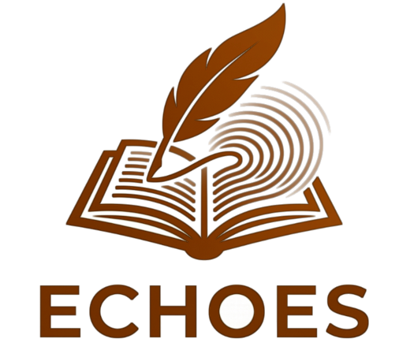
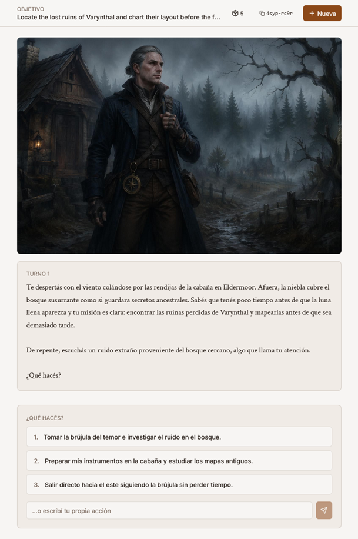

<h1 align="center">Echoes</h1>
<p align="center">
    <i>Generador de Aventuras de Texto con IA</i>
</p>

<p align="center">
    
</p>

## Ejemplo

<p align="center">
    
</p>

---

## 📖 Sobre el Proyecto

**Echoes** es un generador de aventuras de texto interactivo impulsado por Inteligencia Artificial. Permite a los jugadores sumergirse en mundos inmersivos (fantasía, ciencia ficción, terror) donde un narrador virtual dinámico responde y adapta la historia según las decisiones del jugador. El sistema separa la narrativa en texto natural del estado estructurado (inventario, ubicación, actitud de NPCs), asegurando coherencia a largo plazo sin alucinaciones.

## ✨ Características Principales

- **Narrador Adaptativo:** Motor de IA que mantiene el tono y responde consistentemente usando parámetros predefinidos.
- **Persistencia del Estado del Mundo:** Seguimiento de inventario, ubicaciones, relaciones con NPCs y eventos clave usando un contrato estructurado JSON.
- **Imágenes Procedurales:** Generación automática de ilustraciones bajo demanda cuando la narrativa lo amerita.
- **Arquitectura Robusta:** Frontend interactivo y responsivo, acoplado a un backend asíncrono y seguro.

## 🛠️ Tecnologías y Stack

### Backend
- **Framework:** Python 3.12, FastAPI
- **Validación:** Pydantic
- **Base de Datos:** Azure Cosmos DB (Serverless)
- **Almacenamiento:** Azure Blob Storage (Para recursos e imágenes)
- **IA:** Microsoft Foundry (Modelos `gpt-4.1-mini` y `gpt-image-2`)
- **Monitoreo:** Azure Monitor / Application Insights

### Frontend
- **Framework:** Next.js 15, React 18
- **Estilos y UI:** Tailwind CSS, Radix UI, Class Variance Authority
- **Estado y Fetching:** Zustand, React Query (@tanstack/react-query)
- **Tipado:** TypeScript con generación de tipos basada en OpenAPI

## 🚀 Prerrequisitos

Para correr el proyecto de forma local vas a necesitar:
- **Node.js** (v18+).
- **Python 3.12**.
- **Azure CLI** y una suscripción a Azure (idealmente *Azure for Students*) con cuota disponible para recursos de Foundry.

## 📦 Instalación y Configuración

### 1. Backend

Desde la raíz del proyecto, ingresa a la carpeta `backend`, crea el entorno virtual e instala las dependencias:

```bash
cd backend
python -m venv .venv

# En Windows:
.venv\Scripts\activate
# En Linux/Mac:
source .venv/bin/activate

pip install -e .[dev]
```

Configura tus variables de entorno (usando `.env.example` como guía):
```bash
cp .env.example .env
```

Para levantar el servidor local:
```bash
fastapi dev app/main.py
# El backend estará disponible en http://localhost:8000
```

### 2. Frontend

En una nueva terminal, ve a la carpeta `frontend` e instala las dependencias de Node:

```bash
cd frontend
npm install
```

Configura tus variables de entorno:
```bash
cp .env.local.example .env.local
```

Genera los tipos del contrato de la API (Asegúrate de que el backend ya esté corriendo en el puerto 8000):
```bash
npm run gen:types
```

Inicia el servidor de desarrollo:
```bash
npm run dev
# El frontend estará disponible en http://localhost:3000
```

## ☁️ Despliegue en Azure

El proyecto requiere múltiples recursos administrados en la nube de Microsoft. Puedes encontrar la guía paso a paso para aprovisionar el entorno completo en:
👉 **[Guía de Setup en Azure](./docs/setup_azure.md)**

## 📚 Documentación Adicional

- [Diseño y Filosofía de Prompts](./docs/prompts.md): Contiene las definiciones del system prompt principal y el JSON schema estricto con el que responde el LLM.
- [Definición del Proyecto](./docs/Definicion%20del%20Proyecto.docx): Documento detallado de alcance y requerimientos.